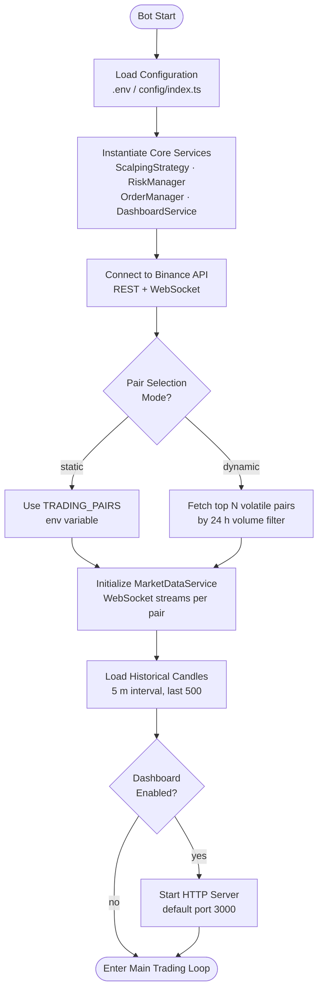
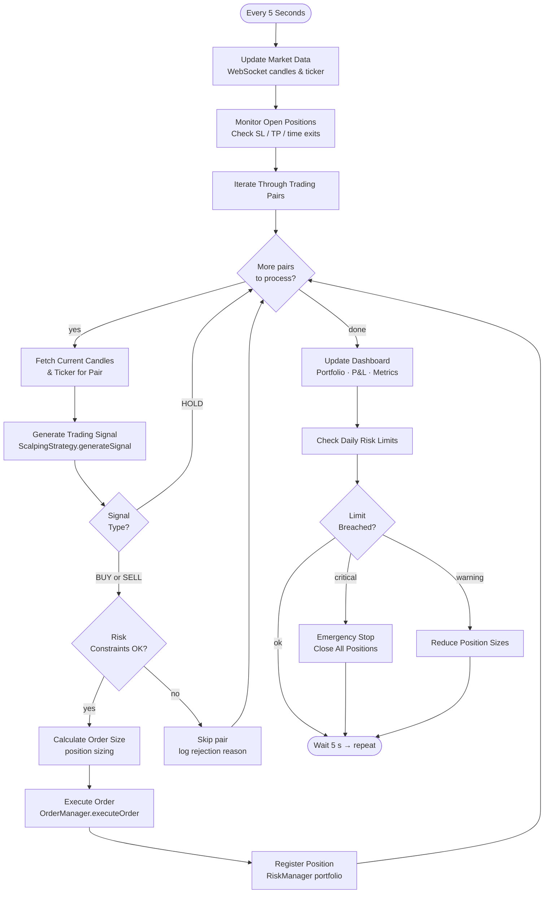
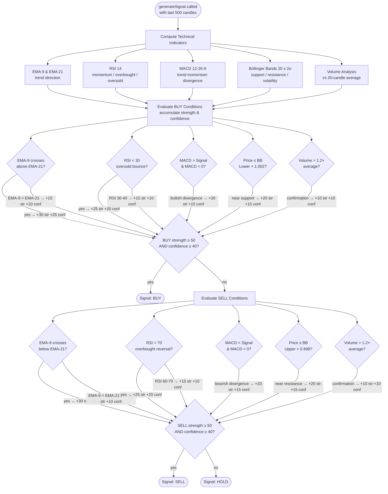
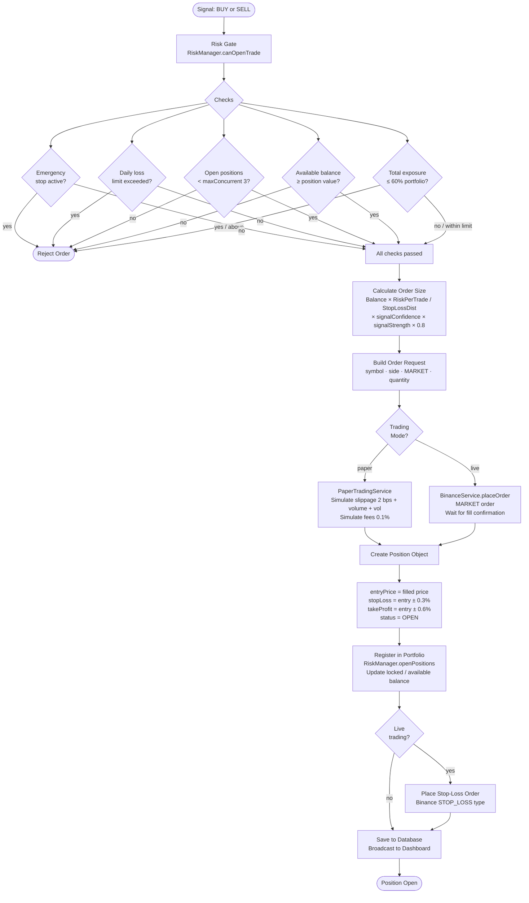
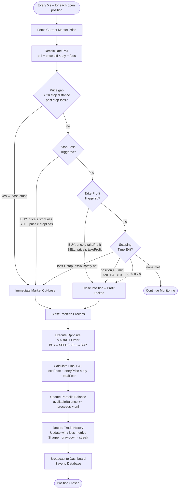
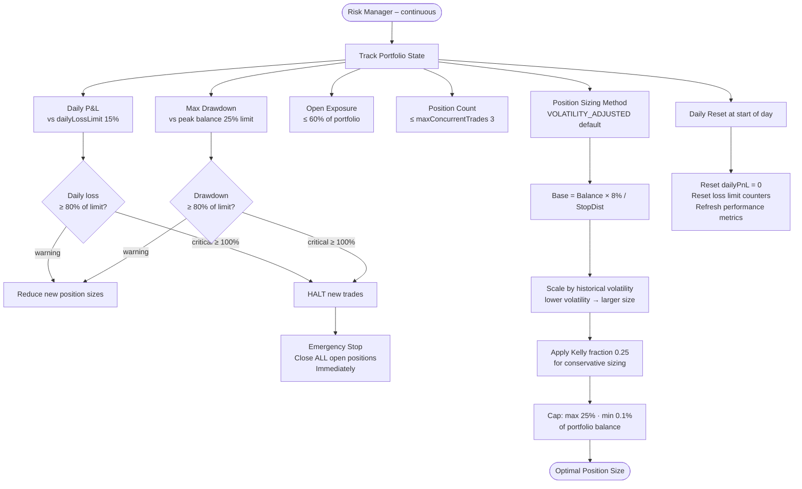
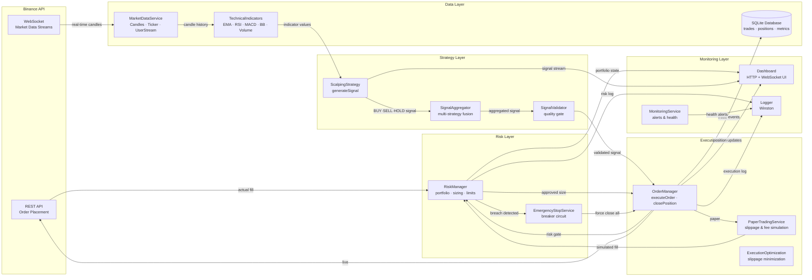

# Scalping Strategy Workflow

This document describes the complete workflow of the Binance scalping bot, from initialization through signal generation, order execution, and position management.

---

## 1. Bot Initialization

---

## 2. Main Trading Loop (every 5 seconds)

---

## 3. Signal Generation – Technical Indicator Analysis

---

## 4. Order Execution

---

## 5. Position Monitoring & Exit Conditions

---

## 6. Risk Management Overview

---

## 7. Complete End-to-End Architecture

---

## Key Parameters Reference

| Parameter | Default | Purpose |
|---|---|---|
| EMA Short / Long | 9 / 21 | Trend direction crossover |
| RSI Period | 14 | Momentum; oversold < 30, overbought > 70 |
| MACD | 12-26-9 | Trend momentum & divergence |
| Bollinger Bands | 20 ± 2σ | Support / resistance / volatility |
| Volume Multiplier | 1.2× avg | Signal confirmation filter |
| Signal Threshold | strength ≥ 50, confidence ≥ 40 | Quality gate for execution |
| Stop Loss | 0.3% | Hard exit on adverse price move |
| Take Profit | 0.6% (1:2 R/R) | Profit target per trade |
| Risk Per Trade | 8% of capital | Position sizing limit |
| Max Concurrent Trades | 3 | Portfolio diversification |
| Max Total Exposure | 60% of portfolio | Risk concentration limit |
| Daily Loss Limit | 15% | Emergency brake |
| Max Drawdown | 25% from peak | Equity protection |
| Scalping Time Exit | 5 min + P&L > 0 | Time-based profit lock |
| Loop Interval | 5 seconds | Trade frequency |
| Candle Timeframe | 5 m | Analysis resolution |
